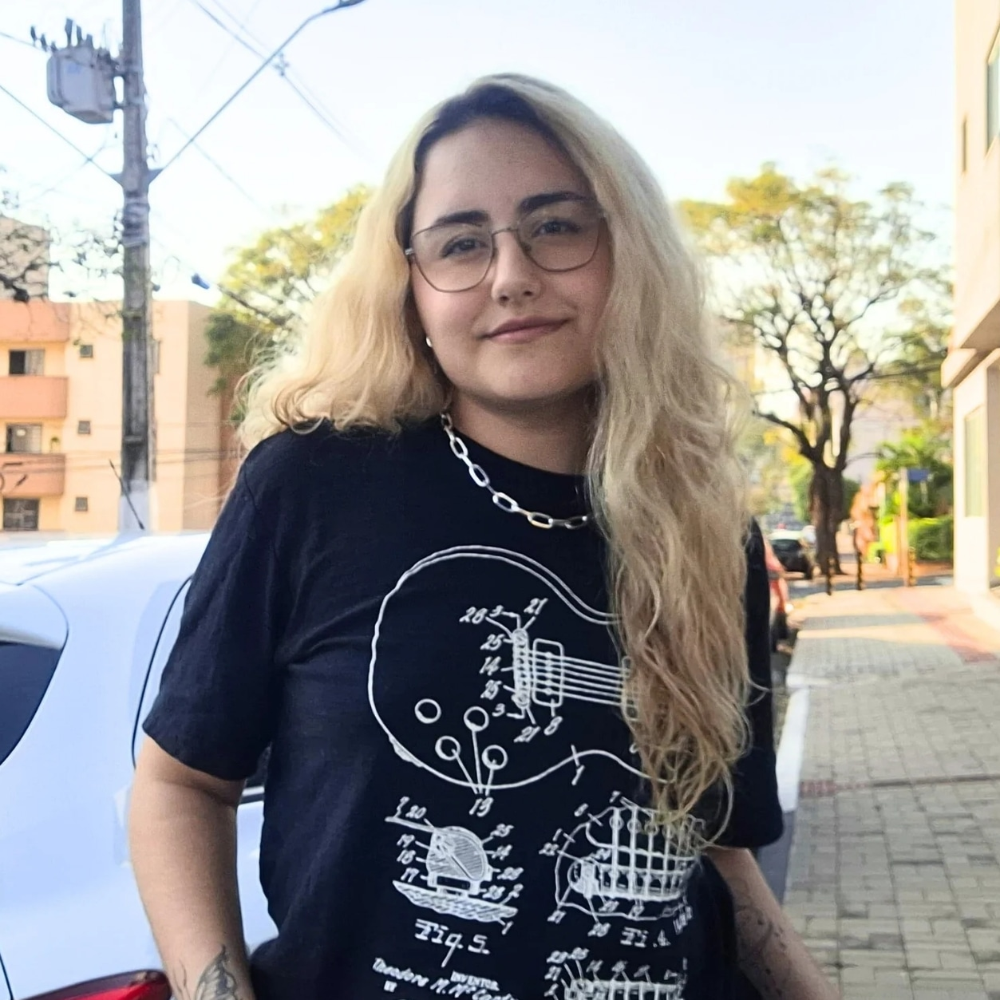

[Vscoders-AS63C-2024.2]

# Apresentação 

Seja Bem-vindo/a ao repositório do grupo Vscoders, somos um grupo dedicado ao desenvolvimento ágil, nosso objetivo é apresentar nosso projeto e utilizar de metodologias ágeis para realização do mesmo.

# AS63C - Desenvolvimento Ágil - 2024 - 3º Semestre

>[INTEGRANTES]
>
> Integrantes do projeto
> Igor Martins dos Santos - https://github.com/IgorMartins04
>
> 
>
> Eleonora Gaspari - https://github.com/nora-gaspari
>
>
> Joaquim Rodrigues - https://github.com/Joaquim-35
>
>
> Luiz Antonio da Silva Marçon - https://github.com/MarconLuizz
>
>
> Talita Leoni - https://github.com/TalitaLeoni
>

# Descrição do Projeto 

Nosso projeto tem o objetivo de um sistem de aluguel e compra de veículos, será uma plataforma completa e de facil utilização. 
Ela oferecerá uma interface intuitiva tanto para os clientes quanto para os administradores, facilitando o acesso para inúmeras opções de veículos. Nosso público alvo é direcionado tanto para as pessoas que desejam, quanto para aquelas que querem adquirir um veículo.  

>[!IMPORTANT]
> ### por enquanto não há documentação, em breve em atualizações futuras...

